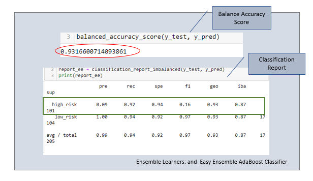

# _You're APPROVED!_ || Fast Lending, Credit Risk Analysis

## Overview of Study

Fast Lending, a peer-to-peer lending service company, is seeking a more efficient way to predict credit risk, primarily through Machine Learning. Additionally, on the front-end, the hope is to create and offer a better loan experience, overall, to loan applicants based on swiftness and reliability. 

To accomplish this task, a study of a 2019 credit dataset from peer-to-peer lending service company, LendingClub, was analyzed in a series of models to train and evaluate various techniques on the unbalanced classes of which loans are good opposed to which poses risk. 

## Resources 

* Data Source(s): [LoanStats_2019Q1.zip](https://app.box.com/s/69jvd0bg84y78fj6vw338ktbd5mqouiw) 
* Software/Tools: Python | Python Libraries/Packages: SciKit-Learn, Imbalanced-learn | VS Code 1.54.3 | Jupyter Notebook** | Anaconda (MLEV)
  *  Data Access: Workaround, [Project Jupyter: jupyter nbviewer](https://nbviewer.jupyter.org/), a Jupyter Notebook renderer **
     *    Data may not display properly on GitHub, please use provided workaround

## Results
The following algorithms: *Naïve Random Oversampling (RandomOverSampler)*, _SMOTE Oversampling_,  _Undersampling with ClusterCentroids_, _SMOTEEN (combination of over and undersampling)_, and _Ensemble Learners:  Random Forest Classifier and  Easy Ensemble AdaBoost Classifier_ were trained and evaluated to predict high credit risk. 

The below chart showcases the balanced accuracy score, precision, and recall(sensitivity) of the former models tested. Visuals, and/or full classification reports can be viewed by clicking through each model's title column.

| |[Naive Random Oversampling](images/naive_random_sampling.png) | [SMOTE Oversampling](images/smote_oversampling.png) |  [ClusterCentroids (Undersampling)](images/clustercentriod_undersampling.png) | [SMOTEEN](images/smoteen_over_undersampling.png) |[Random Forest Classifier (Ensemble Learners)](images/ensemble_random_forest_classifier.png) |[Easy Ensemble AdaBoost Classifier  (Ensemble Learners)](images/ensemble_easy_ensemble_adaboost_classifier.png)
| --------------- | --------------- | ------------ |-------------|--------|----------|------------|
|Balanced Accuracy Score | 0.6503524738582371| 0.6621602612787003 | 0.5442661782548694 | 0.644711676499736| 0.7885466545953005 | 0.9316600714093861|
| Precision| 0.01 |  0.01 | 0.01      | 0.01| 0.03       | 0.09|
| Recall| 0.69 | 0.63      | 0.69      | 0.72      | 0.70      | 0.92| 

#
**What _are_ the numbers saying?**

* **Naïve Random Oversampling** 

    Model produced a balance accuracy score of **0.65** or **65 %**, while precision of 0.01 suggests only **1 %** of high-risk loans were detected.  However, of that 1% detected there is a 69% recall(sensitivity) rate of _actual_ high risk applications that were flagged. 

*	**SMOTE Oversampling**

    Model scored slightly better with a given balance accuracy score of **66 %**, however, remained relatively low on high-risk detection with a precision rate of **1 %** and a recall rate **63 %** of high-risk cases flagged. 

*	**ClusterCentriods (Undersampling)**

    Model scored the lowest balanced accuracy score of **54 %** but remained consistent with previous models of a precision rate of **1 %** in detecting high-risk loans and recall of **69 %** of _actual_ high risk loans flagged. 

*	**SMOOTEEN**

    Model balanced accuracy score is **64 %**, with a low precision rate of **1 %** and a slighter higher recall of **72 %** of _actual_ high risk loan flagged.

*	**Ensemble Learners: Random Forest Classifier**

    Model ranked in a balanced accuracy score of **78 %**, with a notable jump in precision at **3 %**, coupled with a recall of **70 %** of _actual_ high risk loans flagged. 

* **Ensemble Learners: Easy Ensemble AdaBoost Classifier**

  Model significantly produced higher results than previous, with a balanced accuracy score of **93 %**, accompanied with **9 %** precision and **92 %** recall rate of _actual_ high risk loans flagged. 

## Summary

Each of the six models tested and evaluated resulted in a low precision and high sensitivity performance. Meaning, although, the recall of each model in flagging high-risk illustrated a relatively high percentage (above 50%) the precision of each model remained comparatively and significantly low, reaching no more than 10%, collectively. 

Nonetheless, despite these findings one model “outperformed” better that rest; that model being Easy Ensemble AdaBoost Classifier, with a high balanced accuracy score of 93% and precision and recall of 9% and 92%, respectively!

In looking at its full [classification report](images/ensemble_easy_ensemble_adaboost_classifier.png), it would be worth to take note of the F1 score of this model with regards to the high-risk class, in additional to precision and sensitivity outputs, a prominent score of 16 %. 

 <b><i>Easy Ensemble AdaBoost Classifier</b></i> 
 

 
 

Because there is quite a bit of an imbalance between precision and recall the F1 score will be expectantly,low.(Keeping mind, the closer to the value of 1, or 1 %, the more favorable.) However, the model should not be discredited as it does avail enough insight in uncovering high-credit risk and how to proceed with improving existing and creating future product/service offerings.    

#### Author 

_Whitney D. Gardner_

        

